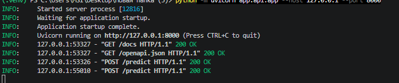
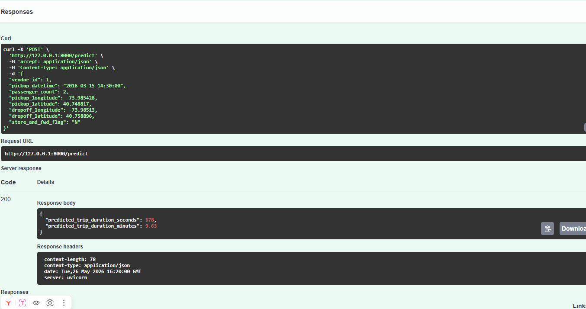
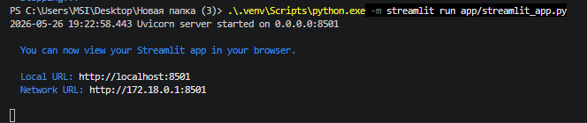
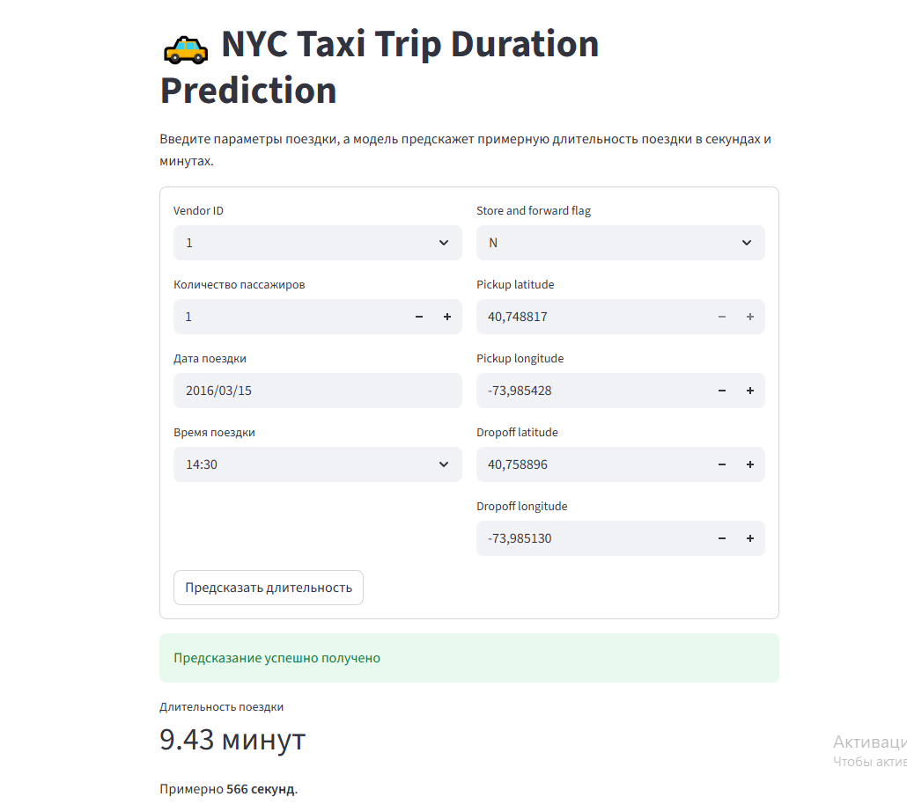

# Отчёт по проекту  
# NYC Taxi Trip Duration Prediction

**Студент:** Матюхин Георгий Александрович  
**Группа:** БИВ238  
**Курс:** Machine Learning Group Project  

## 1. Введение и постановка задачи

Цель проекта — построить модель машинного обучения, которая предсказывает длительность поездки такси в Нью-Йорке по информации о заказе. В качестве данных используется датасет соревнования **NYC Taxi Trip Duration** с платформы Kaggle. В проекте решается задача регрессии: по признакам поездки необходимо предсказать числовое значение — продолжительность поездки в секундах.

Такая задача имеет практический смысл, потому что оценка времени поездки важна для сервисов такси, навигационных приложений и систем планирования маршрутов. Пользователь хочет заранее понимать примерное время в пути, а сервису важно корректно оценивать загрузку водителей, время подачи машины и стоимость поездки.

Входными данными являются характеристики поездки: идентификатор перевозчика, время начала поездки, координаты посадки и высадки, количество пассажиров и другие признаки. Целевой переменной является `trip_duration` — длительность поездки.

Для оценки качества использовалась метрика **RMSLE**:

```math
RMSLE = \sqrt{\frac{1}{n}\sum_{i=1}^{n}(\log(1 + \hat{y_i}) - \log(1 + y_i))^2}
```

Выбор RMSLE обоснован тем, что длительность поездки имеет неравномерное распределение: большинство поездок короткие или средние, но встречаются очень длинные поездки и выбросы. Обычная RMSE слишком сильно штрафовала бы модель за большие ошибки на длинных поездках. RMSLE сглаживает влияние крупных значений и оценивает относительную ошибку, что лучше подходит для данной задачи.

## 2. Поиск и описание данных

Для обучения использовался датасет **NYC Taxi Trip Duration**. В нём представлены реальные поездки такси в Нью-Йорке.

В обучающей выборке содержатся данные о поездках, включающие следующие основные признаки:

| Признак | Описание |
|---|---|
| `id` | уникальный идентификатор поездки |
| `vendor_id` | идентификатор поставщика данных или перевозчика |
| `pickup_datetime` | дата и время начала поездки |
| `dropoff_datetime` | дата и время окончания поездки |
| `passenger_count` | количество пассажиров |
| `pickup_longitude` | долгота точки посадки |
| `pickup_latitude` | широта точки посадки |
| `dropoff_longitude` | долгота точки высадки |
| `dropoff_latitude` | широта точки высадки |
| `store_and_fwd_flag` | флаг сохранения данных перед отправкой |
| `trip_duration` | длительность поездки в секундах, целевая переменная |

В тестовой выборке отсутствует целевая переменная `trip_duration`, так как именно её необходимо предсказать.

Первичный анализ данных показал, что задача хорошо подходит для методов машинного обучения на табличных данных. В данных есть как числовые признаки, например координаты и количество пассажиров, так и признаки, которые нужно дополнительно обработать, например дата и время поездки.

Также в данных присутствуют выбросы. Это нормально для реальных данных такси: могут встречаться поездки с очень большой длительностью, некорректными координатами, нулевым количеством пассажиров или необычно длинным маршрутом. Поэтому перед обучением моделей была необходима предварительная обработка.

## 3. Обработка и подготовка данных

Перед обучением моделей была выполнена подготовка данных. Она включала несколько этапов.

### 3.1. Обработка временных признаков

Из признака `pickup_datetime` были выделены дополнительные признаки:

| Новый признак | Смысл |
|---|---|
| `hour` | час начала поездки |
| `day_of_week` | день недели |
| `month` | месяц |
| `is_weekend` | является ли день выходным |

Эти признаки важны, потому что длительность поездки зависит не только от расстояния, но и от времени суток. Например, утром и вечером в городе могут быть пробки, а ночью поездки обычно быстрее. День недели также влияет на трафик: поездки в будние дни и выходные могут отличаться.

### 3.2. Обработка географических признаков

По координатам посадки и высадки был рассчитан признак `distance_km`, то есть примерное расстояние между начальной и конечной точкой поездки. Этот признак оказался самым важным для модели, что логично: чем больше расстояние между точками, тем дольше обычно длится поездка.

В проекте `distance_km` имеет наибольшую важность среди признаков — около 86.4%. Также среди важных признаков отмечены `hour` и `dropoff_latitude`.

### 3.3. Очистка выбросов

В данных были удалены или отфильтрованы некорректные и слишком аномальные значения. Основное внимание уделялось следующим случаям:

- слишком маленькая или слишком большая длительность поездки;
- некорректное количество пассажиров;
- странные координаты посадки или высадки;
- поездки с нулевым или аномально большим расстоянием.

Удаление выбросов помогло сделать обучение более стабильным. Если оставить слишком много аномалий, модель будет пытаться подстроиться под редкие и нехарактерные случаи, из-за чего качество на обычных поездках может ухудшиться.

### 3.4. Кодирование категориальных признаков

Признак `store_and_fwd_flag` был преобразован в числовой формат. Это необходимо, потому что большинство моделей машинного обучения работают с числовыми признаками.

### 3.5. Преобразование целевой переменной

Целевая переменная `trip_duration` была преобразована с помощью логарифмирования:

```math
y = \log(1 + trip\_duration)
```

Такое преобразование хорошо согласуется с метрикой RMSLE и помогает уменьшить влияние очень длинных поездок. После предсказания результат переводится обратно в секунды с помощью обратного преобразования.

### 3.6. Предотвращение data leakage

В проекте отдельно учитывалась проблема утечки данных. Разбиение на train/test выполнялось до feature engineering, очистка выбросов применялась только к train-данным, а преобразования fit выполнялись на train и затем применялись к test. Также использовался `train_test_split` с `random_state=42`.

Это важно, потому что модель не должна получать информацию из тестовой выборки на этапе обучения. Иначе качество будет завышенным и не будет отражать реальную способность модели обобщать данные.

## 4. Baseline-модель

В качестве базовой модели использовалась **Linear Regression**. Baseline нужен для того, чтобы получить простую точку сравнения. Если более сложные модели не дают значимого улучшения относительно линейной регрессии, значит усложнение модели не оправдано.

Результат baseline-модели:

| Модель | RMSLE |
|---|---:|
| Linear Regression | 0.5976 |

Значение RMSLE для Linear Regression составило **0.5976**.

Линейная регрессия дала приемлемую стартовую оценку, но для данной задачи она слишком простая. Зависимость длительности поездки от признаков не является строго линейной. Например, влияние расстояния зависит от времени суток, района города, дня недели и других факторов. Поэтому дальше были протестированы более сложные модели.

## 5. Эксперименты

В ходе работы были протестированы несколько моделей машинного обучения: Linear Regression, KNN, Random Forest, Gradient Boosting, LightGBM, XGBoost и ансамбль.

### 5.1. Сводная таблица экспериментов

| № | Гипотеза | Как проверялось | Результат |
|---:|---|---|---|
| 1 | Простая линейная модель может дать базовое качество | Обучена Linear Regression на подготовленных признаках | Baseline RMSLE = 0.5976 |
| 2 | Модель KNN сможет учитывать похожие поездки | Обучена KNN-регрессия на числовых признаках | Качество ограничено, модель хуже бустингов |
| 3 | Random Forest лучше уловит нелинейные зависимости | Обучен Random Forest Regressor | Качество лучше baseline, но модель тяжелее и уступает бустингам |
| 4 | Gradient Boosting даст более точные предсказания | Обучен Gradient Boosting Regressor | Качество улучшилось за счёт последовательного исправления ошибок |
| 5 | LightGBM будет хорошо работать с табличными данными | Обучена модель LightGBM | Модель показала высокое качество и хорошую скорость |
| 6 | XGBoost может дать лучшее качество среди одиночных моделей | Обучена модель XGBoost | Лучший результат среди одиночных моделей: RMSLE = 0.3643 |
| 7 | Ансамбль XGBoost + LightGBM даст небольшое улучшение | Предсказания двух моделей были объединены | Финальный результат ансамбля: RMSLE = 0.3639 |

Лучшая одиночная модель — **XGBoost** с RMSLE **0.3643**, а ансамбль **XGBoost + LightGBM** показал RMSLE **0.3639** и был выбран для финального решения.

### 5.2. Анализ результатов экспериментов

Первый эксперимент с линейной регрессией показал, что простая модель может использовать базовые зависимости, но её качества недостаточно. Это ожидаемо, потому что длительность поездки зависит от сложного сочетания факторов.

KNN в данной задаче не является оптимальным решением. Для больших табличных данных такая модель может быть медленной и чувствительной к масштабу признаков. Кроме того, похожесть поездок по координатам и времени не всегда напрямую означает одинаковую длительность.

Random Forest улучшил качество по сравнению с baseline, потому что деревья решений лучше работают с нелинейными зависимостями. Однако ансамбли бустинга оказались эффективнее.

Gradient Boosting, LightGBM и XGBoost показали лучшие результаты, потому что они последовательно исправляют ошибки предыдущих деревьев и хорошо подходят для табличных данных. Особенно хорошо себя показал XGBoost.

Ансамбль XGBoost + LightGBM дал небольшое, но стабильное улучшение. Это объясняется тем, что модели имеют разные внутренние механизмы обучения и могут дополнять друг друга. Даже если улучшение небольшое, оно полезно, потому что в соревнованиях и учебных ML-проектах важны десятые и сотые доли метрики.

## 6. Финальная модель и интерпретируемость результатов

Финальным решением был выбран ансамбль из **XGBoost** и **LightGBM**. Финальная отправка основана именно на ансамбле XGB+LGBM, а значение RMSLE ансамбля составило **0.3639**.

Выбор финальной модели обоснован следующими причинами:

1. **XGBoost показал лучшее качество среди одиночных моделей.**  
   Его RMSLE составил 0.3643, что значительно лучше baseline-модели.

2. **LightGBM хорошо подходит для табличных данных.**  
   Эта модель быстро обучается и обычно показывает сильные результаты на структурированных признаках.

3. **Ансамбль улучшил результат.**  
   Объединение XGBoost и LightGBM позволило снизить RMSLE до 0.3639.

4. **Модель использует логичные признаки.**  
   Самым важным признаком оказался `distance_km`, что соответствует предметной области: расстояние напрямую влияет на длительность поездки.

Интерпретируемость результатов строится через важность признаков. В проекте выделены три наиболее важных признака:

| Признак | Важность | Интерпретация |
|---|---:|---|
| `distance_km` | 86.4% | Основной фактор длительности поездки |
| `hour` | 3.1% | Время суток влияет на загруженность дорог |
| `dropoff_latitude` | 2.7% | Район высадки влияет на маршрут и дорожную ситуацию |

Эти результаты выглядят логично. Расстояние должно быть главным фактором, так как более длинная поездка обычно занимает больше времени. Время суток также важно из-за пробок и разной активности города. Координаты высадки могут отражать особенности районов Нью-Йорка: центр города, аэропорты, жилые районы и другие зоны имеют разную дорожную нагрузку.

При этом у финальной модели есть trade-off. XGBoost и LightGBM менее интерпретируемы, чем линейная регрессия, но дают существенно лучшее качество. Для данной задачи это оправдано, потому что основной целью является точное предсказание длительности поездки.

## 7. Деплой

На данном этапе для проекта планируется реализовать локальный деплой модели. Так как задача связана с предсказанием числового значения по введённым признакам, удобным вариантом является связка:

- **FastAPI** — для API, через который можно отправлять запросы к модели;
- **Streamlit** — для простого пользовательского интерфейса;
- сохранённая модель — для получения предсказаний без повторного обучения.

Планируемая структура деплоя:

```text
app/
├── api.py
├── streamlit_app.py
├── preprocessing.py
└── model.pkl
```

API должен принимать параметры поездки:

- дату и время начала поездки;
- количество пассажиров;
- координаты посадки;
- координаты высадки;
- `vendor_id`;
- `store_and_fwd_flag`.

После этого API должен выполнить такую же подготовку признаков, как в ноутбуке, передать данные в модель и вернуть предсказанную длительность поездки.

Пример ожидаемого ответа API:

```json
{
  "predicted_trip_duration_seconds": 735,
  "predicted_trip_duration_minutes": 12.25
}
```

Streamlit-интерфейс должен позволять пользователю ввести параметры поездки через форму и получить результат в удобном виде.

### Скриншоты работы

**Скриншот 1. Запуск FastAPI-сервера**



**Скриншот 2. Успешный POST-запрос к FastAPI `/predict`**



**Скриншот 3. Запуск Streamlit-интерфейса**



**Скриншот 4. Результат предсказания в Streamlit**




### Видео демонстрации

```text
Ссылка на видео: [добавить ссылку после записи]
```

В видео нужно показать:

1. запуск API;
2. запуск интерфейса;
3. ввод данных поездки;
4. получение предсказания;
5. краткое объяснение, что модель использует признаки поездки и возвращает длительность в секундах/минутах.

## 8. Заключение и выводы

В ходе проекта была решена задача предсказания длительности поездки такси в Нью-Йорке. Были выполнены основные этапы ML-проекта: анализ данных, обработка выбросов, создание новых признаков, обучение baseline-модели, сравнение нескольких алгоритмов и выбор финального решения.

Baseline-модель Linear Regression показала RMSLE **0.5976**. Этот результат использовался как отправная точка для сравнения. Более сложные модели, особенно XGBoost и LightGBM, значительно улучшили качество. Лучшей одиночной моделью стал XGBoost с RMSLE **0.3643**, а финальным решением был выбран ансамбль XGBoost + LightGBM с RMSLE **0.3639**.

Главным фактором длительности поездки оказался признак `distance_km`, то есть расстояние между точкой посадки и точкой высадки. Также важными оказались временные и географические признаки. Это подтверждает, что модель использует осмысленные зависимости, а не случайные закономерности.

Итоговая модель показывает хорошее качество для учебного ML-проекта и может быть использована в простом сервисе предсказания длительности поездки. Для практического использования модель можно развернуть через FastAPI и добавить пользовательский интерфейс на Streamlit. Это позволит отправлять параметры поездки через форму или API и получать прогноз в удобном формате.
